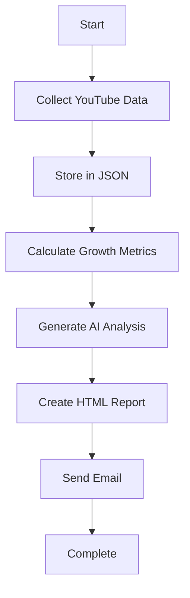

# 🎥 YouTube Analytics AI Agent

> **AI-powered YouTube video performance tracking and analysis system with automated email reports**

[](https://www.python.org/downloads/)
[](LICENSE)
[](https://github.com/YashSuman/Youtube-Analytics-AI-Agent)

## 📋 Table of Contents

- [Features](#-features)
- [Prerequisites](#-prerequisites)
- [Installation](#-installation)
- [Configuration](#-configuration)
- [Usage](#-usage)
- [Project Structure](#-project-structure)
- [API Setup](#-api-setup)
- [Email Configuration](#-email-configuration)
- [Customization](#-customization)
- [Troubleshooting](#-troubleshooting)
- [Contributing](#-contributing)

## ✨ Features

- 📊 **Real-time YouTube Video Tracking** - Monitor views, likes, comments, and engagement metrics
- 🤖 **AI-Powered Analysis** - Generate comprehensive insights using Google Gemini AI
- 📧 **Automated Email Reports** - Beautiful HTML email reports with detailed analytics
- 📈 **Growth Rate Calculations** - Track hourly growth rates and performance trends
- 🔄 **Continuous Monitoring** - Run multiple times to build historical data
- 📱 **Mobile-Friendly Reports** - Responsive HTML email formatting

## 🔧 Prerequisites

- Python 3.8 or higher
- Google API Console account
- Gmail account with App Password enabled
- Google Gemini API access

## 🚀 Installation

### 1. Clone the Repository
```bash
git clone https://github.com/YashSuman/Youtube-Analytics-AI-Agent.git
cd Youtube-Analytics-AI-Agent
```

### 2. Install Dependencies
```bash
pip install -e .
```

Or install manually:
```bash
pip install google-generativeai python-dotenv google-api-python-client
```

### 3. Create Environment File
Create a `.env` file in the project root:
```env
YOUTUBE_API_KEY=your_youtube_api_key_here
GEMINI_API_KEY=your_gemini_api_key_here
GMAIL_USER=your_gmail_address@gmail.com
GMAIL_APP_PASSWORD=your_gmail_app_password
```

## 🔑 Configuration

### YouTube API Setup

1. Go to [Google Cloud Console](https://console.cloud.google.com/)
2. Create a new project or select existing one
3. Enable **YouTube Data API v3**
4. Create credentials (API Key)
5. Copy the API key to your `.env` file

### Gemini AI Setup

1. Visit [Google AI Studio](https://aistudio.google.com/)
2. Get your Gemini API key
3. Add it to your `.env` file

### Gmail Setup

1. Enable 2-Factor Authentication on your Google Account
2. Go to [App Passwords](https://myaccount.google.com/apppasswords)
3. Generate an app password for "Mail"
4. Use this password in your `.env` file (not your regular Gmail password)

## 📊 Usage

### Basic Usage

1. **Add Video IDs** to track in `main.py`:
```python
VIDEO_IDS = [
    "JgDNFQ2RaLQ",  # Replace with your video IDs
    "dQw4w9WgXcQ",  # Add more as needed
]
```

2. **Run the analyzer**:
```bash
python main.py
```

### Advanced Usage

```python
from main import main

# Run with custom settings
analysis_file = main(
    send_email=True,                    # Enable/disable email
    recipient_email="custom@email.com"  # Custom recipient
)
```

### Extract Video ID from YouTube URL

```
YouTube URL: https://www.youtube.com/watch?v=JgDNFQ2RaLQ
Video ID: JgDNFQ2RaLQ (everything after 'v=')
```

## 📁 Project Structure

```
Youtube-Analytics-AI-Agent/
│
├── main.py              # Main execution script
├── youtube_data.py      # YouTube data collection (missing from files)
├── gemini_analysis.py   # AI analysis using Gemini
├── gmail_sender.py      # Email report functionality
├── pyproject.toml       # Project configuration
├── .env                 # Environment variables (create this)
├── .gitignore          # Git ignore file
└── README.md           # This file
```

## 🔄 How It Works



## 📈 Sample Output

The system generates comprehensive reports including:

- **Performance Summary** - Overall video comparison
- **Growth Rate Analysis** - Hourly growth trends
- **Engagement Quality** - Like/comment ratios
- **Content Insights** - AI-powered recommendations
- **Trend Predictions** - Future performance forecasts

## 🛠️ Customization

### Modify Analysis Parameters

Edit `gemini_analysis.py` to customize the AI analysis prompt:

```python
def create_analysis_prompt(analysis_data):
    prompt = f"""
    # Add your custom analysis requirements here
    """
```

### Change Email Template

Modify the HTML template in `gmail_sender.py`:

```python
html_body = f"""
<html>
    <!-- Customize your email template -->
</html>
"""
```

### Add More Video IDs

Simply extend the `VIDEO_IDS` list in `main.py`:

```python
VIDEO_IDS = [
    "video_id_1",
    "video_id_2",
    "video_id_3",
    # Add as many as needed
]
```

## 🐛 Troubleshooting

### Common Issues

**API Authentication Errors**
```bash
Error: Invalid API key
```
- Verify your API keys in `.env`
- Check API quotas in Google Console

**Gmail Authentication Failed**
```bash
Gmail authentication failed!
```
- Use App Password, not regular password
- Enable 2-Factor Authentication first

**Insufficient Data Points**
```bash
Not enough data points for analysis
```
- Run the script multiple times to collect data
- Wait between runs for meaningful changes

**Module Import Errors**
```bash
ModuleNotFoundError: No module named 'youtube_data'
```
- The `youtube_data.py` file is referenced but not provided
- You'll need to create this module or modify imports

## 🤝 Contributing

1. Fork the repository
2. Create a feature branch: `git checkout -b feature-name`
3. Commit changes: `git commit -m 'Add feature'`
4. Push to branch: `git push origin feature-name`
5. Submit a pull request

## 📝 License

This project is licensed under the MIT License - see the [LICENSE](LICENSE) file for details.

## 🙋 Support

- **Issues**: [GitHub Issues](https://github.com/YashSuman/Youtube-Analytics-AI-Agent/issues)
- **Email**: yashsuman15@gmail.com

## 🔗 Links

- [YouTube Data API Documentation](https://developers.google.com/youtube/v3)
- [Google Gemini AI](https://ai.google.dev/)
- [Gmail App Passwords](https://myaccount.google.com/apppasswords)

---

<div align="center">
<strong>By YashSuman</strong><br>
<em>Automate your YouTube analytics with the power of AI</em>
</div>